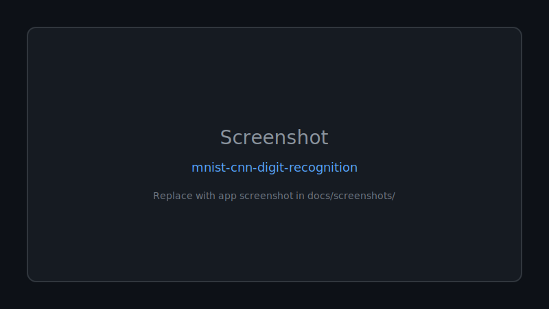
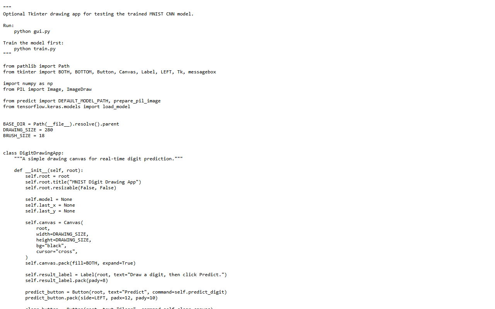

<div align="center">

# 🚀 Mnist Cnn Digit Recognition

**A deep learning project using TensorFlow and Convolutional Neural Networks (CNNs) to recognize handwritten digits from the MNIST dataset with GUI prediction, custom image testing, training visualization, and confusion matrix analysis.**

Documented · MIT licensed · Maintained

[](https://www.python.org/)
[](LICENSE)
[](CONTRIBUTING.md)

[Features](#-features) · [Quick Start](#-quick-start) · [Screenshots](#-screenshots) · [Contributing](CONTRIBUTING.md)

</div>

---

## 🖼 Screenshots



*Replace `docs/screenshots/placeholder.svg` with real app screenshots.*

---

## 🐍 Contribution graph


<picture>
  <source media="(prefers-color-scheme: dark)" srcset="https://raw.githubusercontent.com/mafzalkalwardev/mnist-cnn-digit-recognition/output/snake-dark.svg" />
  <source media="(prefers-color-scheme: light)" srcset="https://raw.githubusercontent.com/mafzalkalwardev/mnist-cnn-digit-recognition/output/snake.svg" />
  
</picture>


---

A beginner-friendly deep learning project that trains a Convolutional Neural Network
(CNN) to recognize handwritten digits from the MNIST dataset.

The project demonstrates:

- Loading MNIST from Keras
- Preprocessing image data for CNNs
- Training a CNN with TensorFlow/Keras
- Evaluating accuracy and loss
- Saving and loading a trained model
- Predicting random unseen test images
- Predicting custom local digit images
- Visualizing training curves, predictions, and a confusion matrix
- Optional real-time digit drawing with Tkinter

For report screenshots, see `REPORT_SCREENSHOTS_GUIDE.md`.

## Folder Structure

```text
MNIST_CNN_Project/
│
├── dataset/
├── models/
├── images/
├── main.py
├── train.py
├── predict.py
├── gui.py
├── requirements.txt
└── README.md
```

`dataset/` is included for project organization. MNIST is downloaded automatically
by Keras, so you do not need to manually place dataset files there.

## Installation

Create and activate a virtual environment:

```bash
python -m venv .venv
.venv\Scripts\activate
```

Install dependencies:

```bash
pip install -r requirements.txt
```

If TensorFlow installation fails, check that you are using a TensorFlow-compatible
Python version.

## Train the Model

From inside the project folder, run:

```bash
python train.py --epochs 5
```

Or use the main entry point:

```bash
python main.py train --epochs 5
```

Training will:

- Load MNIST
- Normalize image pixels between 0 and 1
- Reshape images to `(28, 28, 1)`
- One-hot encode labels
- Train the CNN
- Evaluate on test data
- Save the model to `models/mnist_cnn_model.h5`
- Save graphs to the `images/` folder

Expected test accuracy is usually around **98% to 99%** after 5 epochs.

## CNN Architecture

The model uses this structure:

```text
Conv2D
MaxPooling2D
Conv2D
MaxPooling2D
Flatten
Dense
Dropout
Dense Output Layer
```

The output layer has 10 neurons, one for each digit from 0 to 9, and uses
Softmax activation.

## Predict Random Test Images

After training, run:

```bash
python predict.py --random --count 5
```

Or:

```bash
python main.py predict-random --count 5
```

This displays unseen test images with their actual and predicted labels.

## Predict a Custom Image

Place your handwritten digit image inside the `images/` folder. A simple black
digit on a white background works well, and the script will invert it into MNIST
style automatically.

Run:

```bash
python predict.py --image images/my_digit.png
```

Or:

```bash
python main.py predict-custom --image images/my_digit.png
```

The image is converted to grayscale, resized to 28x28, centered, normalized, and
passed into the trained CNN.

## Optional Drawing App

Train the model first, then open the drawing canvas:

```bash
python gui.py
```

Or:

```bash
python main.py gui
```

Draw one digit on the black canvas and click **Predict**.

## Output Files

After training and prediction, the project creates:

- `models/mnist_cnn_model.h5`
- `images/training_accuracy_loss.png`
- `images/confusion_matrix.png`
- `images/random_predictions.png`
- `images/custom_prediction.png`

## Step-by-Step Project Flow

1. Load MNIST using `tensorflow.keras.datasets.mnist`.
2. Normalize images so pixel values are between 0 and 1.
3. Reshape the image arrays into CNN format: `(28, 28, 1)`.
4. Convert labels into one-hot encoded vectors.
5. Build the CNN with convolution, pooling, dense, dropout, and output layers.
6. Train using Adam optimizer and categorical crossentropy loss.
7. Evaluate the model on the test dataset.
8. Save the model as an `.h5` file.
9. Display accuracy/loss graphs and a confusion matrix.
10. Use the saved model to predict random test images or custom images.

## Notes for a Semester Project

This project is intentionally simple enough for beginners while still showing a
professional deep learning workflow. For a report or presentation, include:

- Dataset description
- Preprocessing steps
- CNN architecture diagram
- Training accuracy and validation accuracy graph
- Confusion matrix
- Example prediction screenshots
- Final test accuracy and observations


python train.py --epochs 5


python main.py predict-random --count 5
python main.py predict-custom --image images/my_digit.png
python main.py gui

## Screenshots



